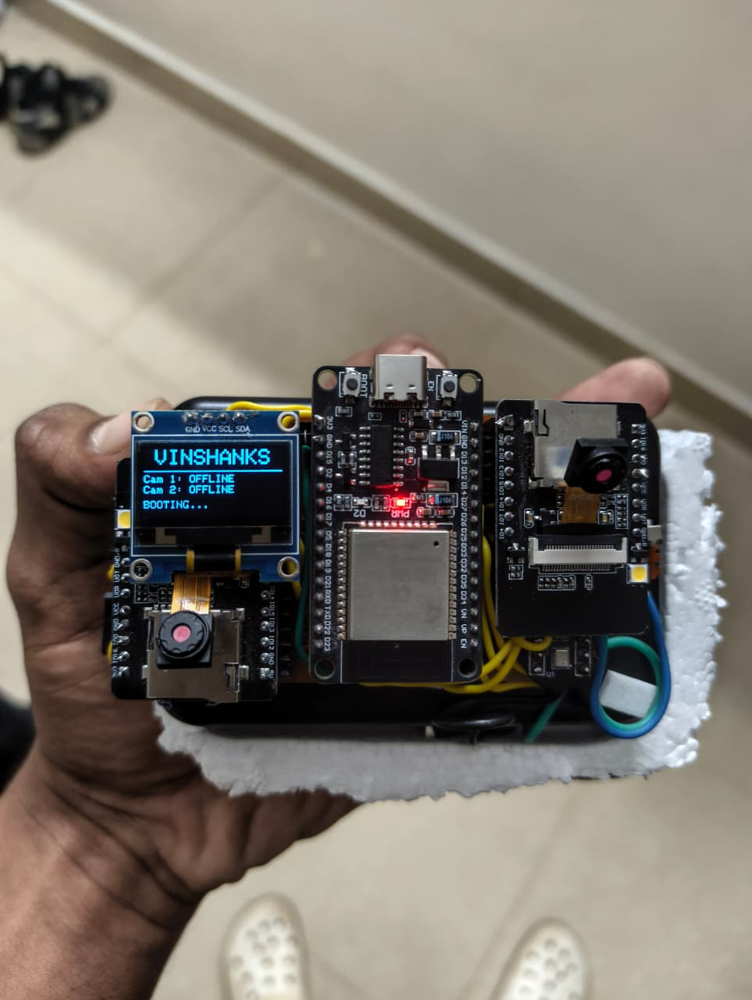

# AI Meeting Assistant - VINSHANKS

A real-time meeting recording system with ESP32-based hardware and cloud-based AI processing for automated meeting transcription, summarization, and documentation.

<p align="center">
   
</p>

## Project Overview

This system captures meetings through ESP32 devices with audio and video capabilities, streams the data to Azure cloud services, and uses AI for speech-to-text transcription, summarization, and meeting insights generation.

## Architecture

```
┌─────────────────┐     ┌─────────────────┐     ┌─────────────────┐
│   Audio Device  │     │  Camera Device  │     │  Camera Device  │
│  (ESP32 + I2S)  │────▶│   (ESP32-CAM)   │────▶│   (ESP32-CAM)   │
│     OLED 128x64 │     │   mDNS: cam1    │     │   mDNS: cam2    │
└─────────────────┘     └─────────────────┘     └─────────────────┘
         │                       │                       │
         └───────────────────────┼───────────────────────┘
                                 ▼
┌─────────────────────────────────────────────────────────────────┐
│                    Azure Cloud Services                          │
│                                                                  │
│  ┌─────────────┐  ┌─────────────┐  ┌─────────────────────────┐  │
│  │  STT Service│  │ Image Store │  │   AI Processing         │  │
│  │  (16000 Hz) │  │  (Blob)     │  │   • Transcription       │  │
│  │             │  │             │  │   • Summarization       │  │
│  │  POST /api/ │  │  POST /api/ │  │   • Action Items       │  │
│  │   upload    │  │ upload_image│  │   • Sentiment Analysis │  │
│  └─────────────┘  └─────────────┘  └─────────────────────────┘  │
│                                                                  │
└─────────────────────────────────────────────────────────────────┘
```

## Hardware Components

### 1. Audio Recording Device (Main Controller)
- **Microcontroller**: ESP32-WROOM
- **Audio Input**: I2S microphone (INMP441/MAX9814)
- **Display**: SSD1306 OLED (128x64)
- **Controls**: 
  - Button 1 (GPIO15): Start Meeting
  - Button 2 (GPIO14): Stop Meeting
  - Button 3 (GPIO0): WiFi Reset
- **Connectivity**: WiFi, mDNS (audio.local)

### 2. Camera Devices (2 Units)
- **Microcontroller**: ESP32-CAM
- **Camera**: OV2640 (VGA resolution)
- **Storage**: PSRAM enabled
- **Connectivity**: WiFi, mDNS (cam1.local, cam2.local)

## Features

### Real-time Features
- **Audio Streaming**: 16kHz, 16-bit PCM audio streaming to cloud
- **Video Capture**: Periodic image capture (every 30 seconds)
- **Device Discovery**: Automatic camera discovery via HTTP polling
- **Meeting Control**: Start/stop meeting with physical buttons

### Cloud Processing
- **Speech-to-Text**: Real-time audio transcription
- **Image Processing**: Attendee detection and scene analysis
- **AI Summarization**: Meeting summaries with action items
- **Storage**: Azure Blob Storage for recordings and images

### Device Features
- **WiFi Management**: WiFiManager for easy network configuration
- **mDNS Support**: Local network discovery
- **OLED Status Display**: Real-time device status
- **Hardware Reset**: Physical WiFi reset button

## Setup Instructions

### Hardware Setup

#### Audio Device Wiring:
```
ESP32      I2S Microphone     OLED Display
GPIO25  ── WS (LRCLK)       SCL (GPIO22)
GPIO26  ── SCK (BCLK)       SDA (GPIO21)
GPIO33  ── SD (DATA)        
GND     ── GND              GND
3.3V    ── VDD              VCC
```

Buttons:
- GPIO15: Start Meeting (Pull-up)
- GPIO14: Stop Meeting (Pull-up) 
- GPIO0: WiFi Reset (Pull-up)

#### Camera Device Wiring:
Standard ESP32-CAM pin configuration with OV2640 camera module.

### Software Setup

1. **Install Arduino IDE** with ESP32 support:
   - Add ESP32 board URL: `https://espressif.github.io/arduino-esp32/package_esp32_index.json`
   - Install ESP32 board package

2. **Required Libraries**:
   - WiFi
   - WebServer
   - WiFiClientSecure
   - HTTPClient
   - ESPmDNS
   - WiFiManager
   - Adafruit SSD1306
   - Adafruit GFX
   - esp_camera (for camera device)

3. **Configure Cloud Endpoints**:
   Update the following constants in the firmware:
   - `CLOUD_HOST`: Your Azure Container Apps endpoint
   - `CLOUD_PATH`: Audio upload API path
   - `UPLOAD_HOST`: Image upload endpoint
   - `UPLOAD_PATH`: Image upload API path

### Cloud Setup

The cloud backend runs on Azure Container Apps with:
- STT (Speech-to-Text) service
- Image processing service
- AI summarization models
- Azure Blob Storage for recordings

## Usage

### Initial Setup
1. Power on all devices
2. Connect to WiFi AP "Audio-ESP32-Setup" or "CAM1_SETUP"
3. Configure WiFi credentials via captive portal
4. Devices will connect and broadcast via mDNS

### Starting a Meeting
1. Press START button on audio device
2. System will:
   - Start streaming audio to cloud
   - Send "start" command to all cameras
   - Begin periodic image capture
   - Update OLED display to "MEETING STARTED"

### Ending a Meeting
1. Press STOP button on audio device
2. System will:
   - Stop audio streaming
   - Send "stop" command to cameras
   - Trigger AI processing on cloud
   - Update OLED display to "MEETING ENDED"

## Cloud API Endpoints

### Audio Device
- **POST** `/api/upload?filename=live.wav&mac_address=MIC_DEVICE_01`
  - Streams audio chunks with chunked transfer encoding
  - Includes WAV header for proper format detection

### Camera Device  
- **POST** `/api/upload_image`
  - Multipart form data with:
    - `mac_address`: Device MAC address
    - `camera_id`: Camera identifier (CAM_1, CAM_2)
    - `file`: JPEG image file

### Processing Trigger
- **POST** `/api/end_session_by_mac?mac_address=MIC_DEVICE_01`
  - Triggers AI processing for the completed meeting

## Project Structure

```
AI-Meeting-Assistant/
├── firmware/
│   ├── audio-device/
│   │   └── audio_device.ino
│   ├── camera-device/
│   │   └── camera_device.ino
│   └── libraries/
├── hardware/
│   ├── schematics/
│   └── pcb-design/
├── cloud-backend/
│   ├── docker/
│   ├── api/
│   └── ai-models/
├── documentation/
│   ├── setup-guide.md
│   └── api-documentation.md
└── docker/
    └── docker-compose.yml
```

## Development

### Building Firmware
1. Open Arduino IDE
2. Select appropriate board:
   - Audio Device: ESP32 Dev Module
   - Camera Device: AI Thinker ESP32-CAM
3. Upload code with appropriate settings

### Testing
- Audio streaming test: Use serial monitor to verify connection
- Camera test: Access http://cam1.local/ in browser
- Cloud integration: Check Azure logs for successful uploads

## Troubleshooting

### Common Issues
1. **WiFi Connection Failed**: Press reset button while holding GPIO0 low
2. **Camera Not Initializing**: Check PSRAM allocation and camera module
3. **Audio Streaming Issues**: Verify I2S microphone connections
4. **Cloud Connection Failed**: Check Azure endpoint and network connectivity

### Debug Logs
Enable Serial debugging at 115200 baud for detailed logs:
- Audio device: COM port monitoring
- Camera device: Serial output via USB

## License

This project is proprietary software developed for VINSHANKS meeting assistant system.

## Contact

For questions and support, contact the development team.

---

**Note**: This project requires Azure cloud services for full functionality. Local testing can be done with mock endpoints.